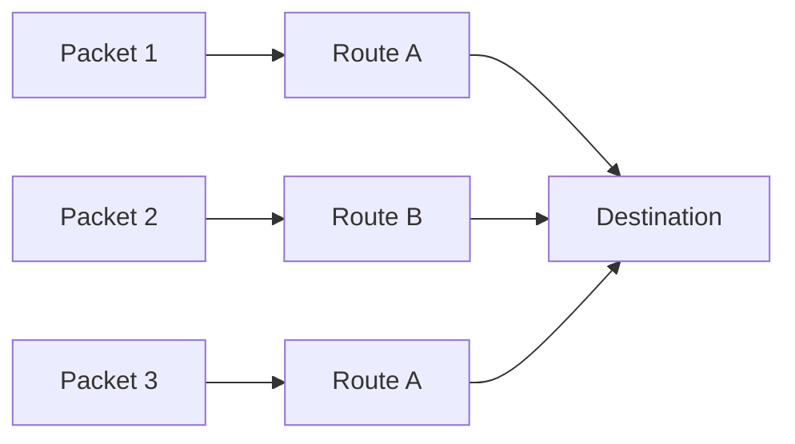

## Wide Area Network (WAN)

The book definition of WAN is that it stands for Wide Area Network. It is a computer network that covers a large geographical area consisting of two or more LANs. These networks are established with leased telecommunication circuits, in which two sides which are connected have routers that connect the LAN of both sides together in a network to facilitate communication.


So basically, if you have 2 houses, house A and house B. Each house has 5 computers and both are connected to their respective LAN A and LAN B. Inside each house, computers can easily communicate with each other but if a computer in House A wants to communicate with a computer in House B which is 500km away, you will need a network connecting these two LANs. This is where WAN came in.

Why need WAN when there is internet no? Good question. The internet is a WAN, but WAN does not equal to the internet. The Internet is the world's largest interconnected network of networks, and it uses WAN infrastructure extensively. But WAN doesn't necessarily mean **the public Internet**. For instance, imagine Maybank has KL HQ connect to Johor Branch thru WAN. The company could have a private WAN connecting its offices. Employees might access this without that traffic being directly exposed to the public internet. 

KL Office ─── Private WAN ─── Johor Office

So what actually connects the WAN? WAN does not magically connect 2 maybank branches, there is some physical or wireless infra underneath. For example:


```mermaid
graph TD
    A[Office A] --> B[Router]
    B --> C[Fiber Optic]
    C --> D[ISP / Carrier Network]
    D --> E[Fiber Optic]
    E --> F[Router]
    F --> G[Office B]c
```
For better contextual understanding regarding WAN lets follow one packet and see clearly how it travels and move. 

1. Suppose you are located in USA and want to access a server in France. Your device might have 192.168.1.20 and the server might have some public IP address. You send a request.
2. So, with that request your laptop creates data. That laptop will send the packet (data) to the router because it realizes the destination isn't inside the local network.
3. Router. The router examines the packet's destination IP, and it determines that this isn't another device in its LAN. So, the router sends the packet towards the ISP.
4. ISP Network. Now this is where we enter WAN portion of this packet Journey. The packet might travel through many routers so to simplified:


---

### WAN does not necessarily mean one giant cable

one might imagine that from USA to France there is one cable connecting the two devices. Not really. Large networks are composed of many interconnected links and routers. There can be multiple possible paths, this is one of the reasons why packet-switched networks are powerful. If one path becomes unavailable, routing mechanism can potentially use another path. 

### Circuit switching vs Packet switching 

WAN technology historically used different approaches.

1. Circuit switching. So imagine someone call you using an old telephone system. You establish a dedicated path user>router A>router B>router C> Friend. Basically resources along that path are reserved for your communication, its like the road is reserved for you for the duration of the call. This is circuit switching and traditional telephone networks are the classic example.
2. Packet Switching. Modern computer networks generally use packet switching. Instead of reserving an entire path, your data gets divided into packets. For instance, sending 'Hello World', the network conceptually breaks it into:
Packet 1 → HEL
Packet 2 → LO
Packet 3 → WORLD

Each packet contains information such as its destinations (header) and the network forwards those packets. So conceptually: 


